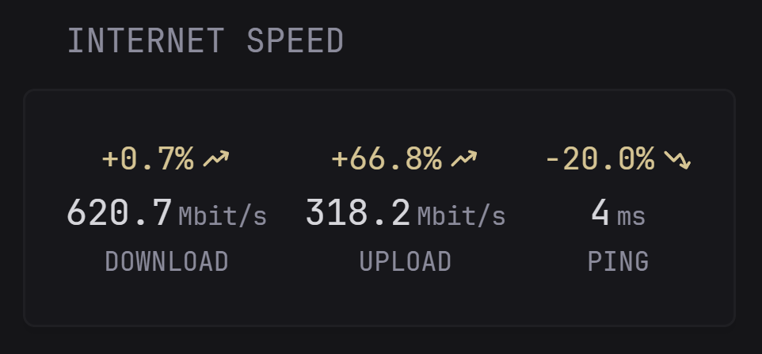
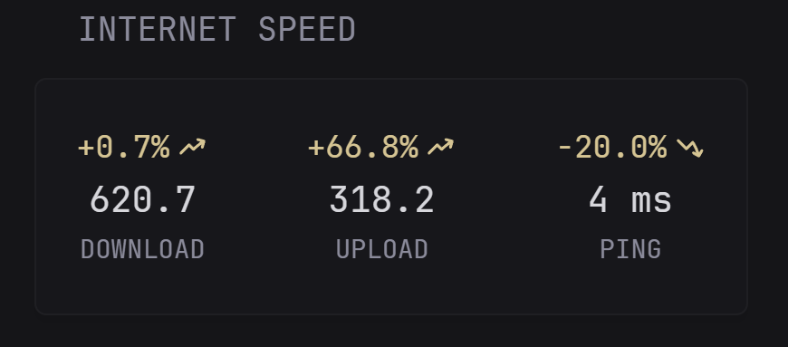

<h1 align="center">glance-myspeed</h1>

<p align="center">
  <strong>A Glance widget to display your MySpeed speedtest results.</strong>
</p>

<p align="center">
  <a href="https://github.com/glanceapp/glance"></a>
  <a href="https://github.com/gnmyt/MySpeed"></a>
  
  
</p>

<p align="center">
  <a href="#overview">Overview</a> •
  <a href="#quick-start">Quick Start</a> •
  <a href="#widget-options">Widget Options</a> •
  <a href="#references">References</a>
</p>

<p align="center">
  
</p>

---

## Overview

A drop-in [Glance](https://github.com/glanceapp/glance) `custom-api` widget to display your [MySpeed](https://github.com/gnmyt/MySpeed) speedtest results.

The widget can optionally show a centered `Last test` footer. The timestamp is formatted based on age:

- today: `Last test: 18:42`
- yesterday: `Last test: yesterday 23:00`
- older: `Last test: 18.03. 23:00`

If `showRelativeTime` is enabled, the footer appends Glance's relative age output with a trailing `ago`, for example `Last test: 18:42 · 27m ago`.

| Widget | Purpose | File |
|---|---|---|
| Speed | Download/Upload speeds with ping and percentage diff from average | `widgets/myspeed.yml` |

---

## Quick Start

1. Copy `widgets/myspeed.yml` into your Glance `widgets/` folder
2. Set `MYSPEED_URL` in your `.env` or Glance environment
3. Include the widget in `glance.yml`

```env
MYSPEED_URL=http://10.10.1.1:5216
```

```yaml
pages:
  - name: Home
    columns:
      - size: full
        widgets:
          - $include: widgets/myspeed.yml
```

Reference config: `examples/glance.yml`

---

## Widget Options

### Speed (`widgets/myspeed.yml`)

**Percentage + Units** (`showPercentageDiff: true`, `showUnit: true`)
<p align="center">
  
</p>

**Percentage only** (`showPercentageDiff: true`, `showUnit: false`)
<p align="center">
  
</p>

**Clean** (`showPercentageDiff: false`, `showUnit: false`)
<p align="center">
  

```yaml
- type: custom-api
  title: Internet Speed
  cache: 1h
  options:
    showPercentageDiff: true
    showUnit: true
    showLastTest: false
    showRelativeTime: false
  template: |
    # Requests and fallback states are handled inside the template
    ...
```

| Option | Type | Default | Description |
|---|---|---|---|
| `showPercentageDiff` | bool | `true` | Show percentage difference from average |
| `showUnit` | bool | `true` | Show "Mbit/s" and "ms" unit labels inline with values |
| `showLastTest` | bool | `false` | Show a centered `Last test` footer with age-aware formatting (`18:42`, `yesterday 23:00`, `18.03. 23:00`) |
| `showRelativeTime` | bool | `false` | When `showLastTest` is enabled, append Glance's relative age output with a trailing `ago` to the `Last test` footer |

---

## References

- **Dashboard platform:** [`glanceapp/glance`](https://github.com/glanceapp/glance)  
  Widget implementation targets Glance `custom-api` behavior and config style.

- **Speedtest software:** [`gnmyt/MySpeed`](https://github.com/gnmyt/MySpeed)  
  Self-hosted speedtest tracking tool

- **Design inspiration:** [`glanceapp/community-widgets`](https://github.com/glanceapp/community-widgets)  
  Original speedtest-tracker widget

---

## License

MIT. See [`LICENSE`](LICENSE).
